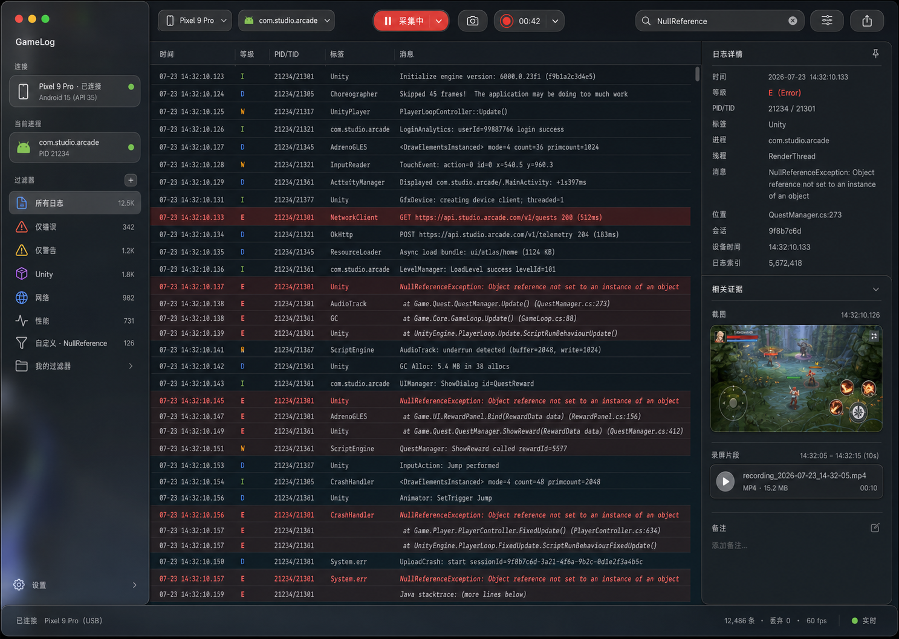
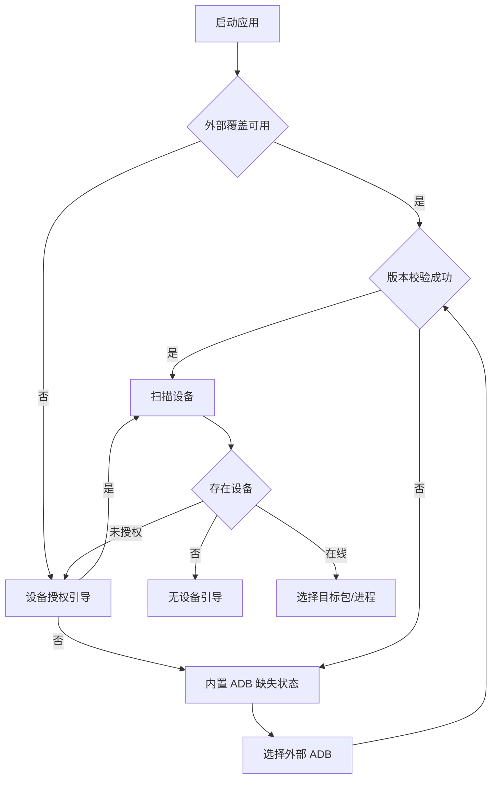
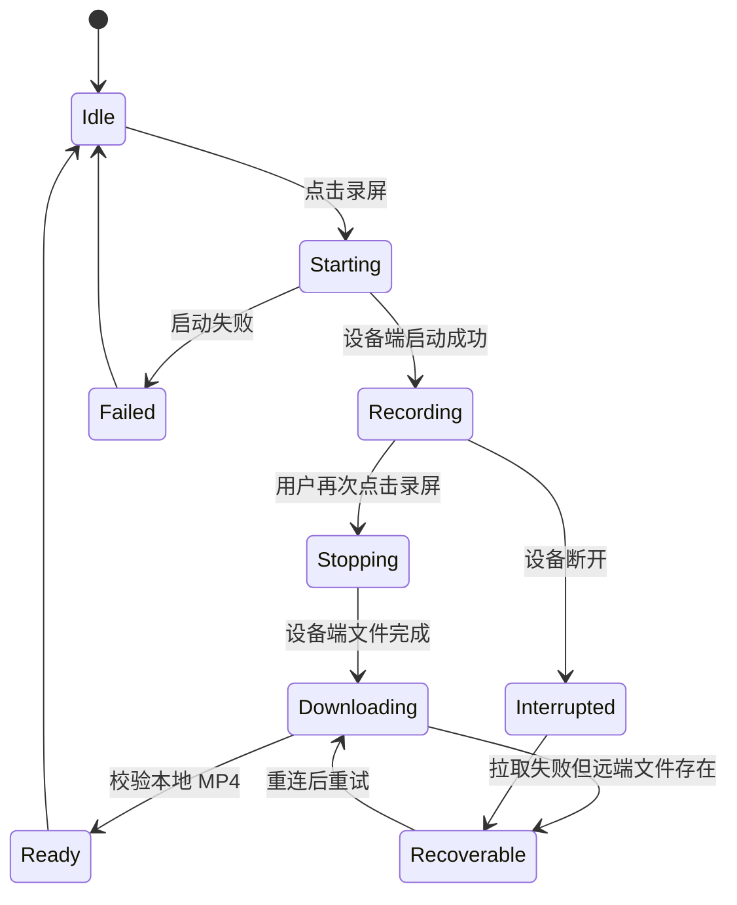

# GameLog macOS 26 页面与交互规格

> 文档版本：1.2.2  
> 日期：2026-07-30  
> 视觉基线：方案 1（日志优先三栏结构）  
> 目标平台：macOS 26 及以上

## 1. 设计结论

GameLog 采用“Sidebar + 日志工作区 + Inspector”的桌面原生结构：

- Sidebar 管理设备、目标进程和过滤预设。
- 中央工作区始终优先展示高密度日志。
- Inspector 展示当前日志详情、截图和录屏。
- 截图和录屏以固定高度证据标记进入日志时间线，不将大图或播放器嵌入高速日志列表。
- Toolbar 承载连接范围、采集状态、截图、录屏、过滤、搜索和导出。

该结构优先使用系统 `NavigationSplitView`、Toolbar、Search 和 Inspector，让 macOS 26 自动提供 Liquid Glass 和窗口适配行为。

## 2. 选定视觉方向



说明：该图片用于表达信息架构、层级和密度，不作为像素级实现依据。以下规格优先级高于图片中的示例文案、颜色、设备名称和数据。

## 3. 应用场景结构

### 3.1 Scene

| Scene | 类型 | 用途 |
| --- | --- | --- |
| 日志窗口 | 多实例 `WindowGroup` | 每个窗口独立选择设备、采集日志和证据 |
| 会话归档 | 单实例 `Window` | 归档浏览、导入、诊断趋势、会话对比、回归、符号化和注释 |
| 设置 | `Settings` | ADB/无线调试、缓存、录屏、脱敏和临时文件设置 |
| 系统文件面板 | `NSOpenPanel` / `NSSavePanel` | 高级覆盖外部 ADB 和选择导出目录 |

P1 通过 `⌘N` 创建并行日志窗口；窗口关闭时先收口自身活动会话。归档窗口不启动 ADB 采集，也不复制主窗口的选择状态。P2 分析和导入均在归档窗口完成，避免打断实时采集工作区。

### 3.3 会话归档窗口

归档窗口使用左侧会话列表和右侧四个顶部分段：

1. 会话：统计、诊断、问题、证据、高频 Tag 和内联注释。
2. 趋势：按目标包聚合跨会话 Crash/ANR。
3. 对比：选择基准与对比会话，显示指标、诊断/Tag 差异、时间轴对齐和回归告警。
4. 符号：配置目标包、`llvm-symbolizer` 与符号目录，再对归档会话执行 Native 符号化。

窗口 Toolbar 提供“导入会话”和“刷新”。导入及选择工具/目录使用系统文件面板；分析结果、状态和错误均回到当前页面原位展示，不增加业务弹窗。

符号页采用三个纵向 `GroupBox`：工具、符号目录、会话符号化。目录行显示完整可选择路径和“移除索引”；结果行依次显示原始地址、最佳函数、源码位置和解析状态。移除索引的帮助文案必须说明不会删除源 `.so`。

### 3.2 主窗口尺寸

- 推荐初始尺寸：1440 × 900 pt。
- 最小尺寸：1100 × 700 pt。
- Sidebar：最小 200 pt，理想 240 pt，最大 300 pt。
- Inspector：最小 300 pt，理想 360 pt，最大 460 pt。
- 中央日志区：最小 600 pt。

当窗口宽度不足时，优先收起 Inspector，其次允许用户收起 Sidebar；日志区不得被压缩到不可阅读宽度。

## 4. 主窗口区域

| 区域 | 内容 | 核心行为 |
| --- | --- | --- |
| A. Toolbar | 设备、包名、采集、截图、录屏、过滤、搜索、导出 | 随会话状态启用或禁用 |
| B. Sidebar | 连接设备、当前目标、过滤预设 | 稳定选择，不使用卡片式导航 |
| C. Log Table | 时间、等级、PID/TID、Tag、Message、证据标记 | 高吞吐、固定行高、自动跟随 |
| D. Inspector | 完整字段、Raw、相关截图和录屏 | 随当前选择更新，可折叠 |
| E. Status Bar | 连接、事件数、淘汰数、采集速率 | 只显示状态，不承载主操作 |

## 5. macOS 26 视觉规则

### 5.1 Liquid Glass

- 使用系统 Toolbar 和 Sidebar 自动提供的 Liquid Glass。
- 不在日志背景、日志行、Inspector 内容卡片或状态栏上叠加自定义 `glassEffect`。
- 不自绘工具栏背景、窗口圆角和侧栏模糊层。
- Toolbar 控件通过 `ToolbarSpacer` 按功能分组。
- 只有“录屏中”“错误”或明确主操作可以使用语义 Tint。

### 5.2 内容层

- 日志区使用系统自适应背景，支持浅色与深色。
- 日志正文使用系统等宽字体，推荐 12–13 pt。
- 默认日志行高 22 pt；证据标记行同样保持紧凑。
- 列表以细分隔线和选中态表达层级，不给每行添加独立卡片、圆角或阴影。
- Error 行可以提高文本和等级标记强调度，但不默认整行使用高饱和红底。

### 5.3 颜色与状态

| 语义 | 表达 |
| --- | --- |
| Verbose | 次要文本 + `V` |
| Debug | 系统蓝色 + `D` |
| Info | 系统绿色或主文本 + `I` |
| Warning | 系统橙色 + `W` |
| Error | 系统红色 + `E` |
| Fatal | 系统红色强化 + `F` |
| 已连接 | 绿色状态点 + “已连接”文字 |
| 恢复中 | 进度指示 + “恢复中”文字 |
| 录屏中 | 红色录制符号 + 计时文字 |

颜色不得是唯一状态表达。

## 6. Toolbar 规格

Toolbar 从左到右分为四组。

### 6.1 连接上下文组

包含：

- 设备选择 Menu/Picker。
- 包名或进程选择 Menu/Picker。

行为：

- 未开始会话时可修改。
- 活动会话中选择器锁定，点击后提示先停止会话。
- 设备状态变化后，设备名称旁显示状态。

### 6.2 采集状态组

包含一个主要状态控件：

- 未采集：显示“开始采集”。
- 启动中：显示 ProgressView 和“启动中”。
- 采集中：显示“采集中”和暂停跟随按钮。
- 暂停跟随：显示“已暂停跟随”和继续按钮。
- 恢复中：显示“恢复中”，禁用截图和录屏。

“暂停跟随”不得停止底层日志流。

### 6.3 证据采集组

包含：

- 截图按钮：相机图标。
- 标记问题按钮：标记图标，位于截图与录屏之间。
- 录屏按钮：录制圆点；录制中显示计时。

行为：

- 仅在活动会话且设备在线时启用。
- 截图进行中显示小型进度状态，防止重复点击。
- 标记问题不打开弹窗：立即写入时间线、自动截图，并在 Inspector 内联编辑。
- 录屏中点击同一控件停止录屏。
- 录屏不显示倒计时，也不会因达到固定时长自动结束。
- 设备需要续录分段时保持录屏状态；仅在用户停止后进入合并和下载状态。

### 6.4 查找与输出组

包含：

- Level/Tag/PID 过滤按钮。
- 系统 Search Field。
- Inspector 显隐按钮。
- 导出按钮。

搜索框位于 Toolbar 尾部，作用域为当前日志工作区，不搜索设置页。

## 7. Sidebar 规格

Sidebar 使用原生 Source List 风格，单行最多一个前导图标、一个标题和一个可选次级信息。

### 7.1 信息分组

1. 连接
   - 当前设备。
   - 连接状态和 Android 版本。
2. 当前目标
   - 包名。
   - 当前 PID 或“等待进程”。
3. 过滤器
   - 所有日志。
   - 仅错误。
   - 仅警告及以上。
   - Unity/网络等用户预设。

设置不作为 Sidebar 项，使用系统 Settings 菜单或 Sidebar 底部的 `SettingsLink`。

### 7.2 Sidebar 选择

- 选择过滤器后更新中央日志快照。
- 设备和目标行是上下文选择器，不作为页面导航目标。
- 删除过滤预设使用 Context Menu 和 Delete 键，并显示确认。
- Sidebar 折叠状态按窗口使用 `SceneStorage` 保存。

## 8. Log Table 规格

### 8.1 列定义

| 列 | 默认宽度 | 最小宽度 | 行为 |
| --- | ---: | ---: | --- |
| 时间 | 128 | 105 | 固定格式 `HH:mm:ss.SSS` |
| 等级 | 48 | 40 | 显示字符与语义色 |
| PID/TID | 110 | 90 | 可按列隐藏 |
| Tag | 150 | 100 | 超长尾部截断 |
| Message | 自适应 | 300 | 单行截断，详情进 Inspector |

用户调整的列宽与可见列作为偏好保存。

### 8.2 行类型

```swift
enum LogRowKind {
    case log
    case screenshotMarker
    case recordingStartedMarker
    case recordingFinishedMarker
    case processLifecycleMarker
    case connectionMarker
    case localSystemMarker
}
```

所有行共享相同基础布局和键盘选择模型。证据标记只使用图标、时间、类型和简短描述，不直接显示大图。

### 8.3 自动跟随

状态：

```text
FollowingLatest → 用户向上滚动 → BrowsingHistory
BrowsingHistory → 点击“回到最新” → FollowingLatest
BrowsingHistory → 滚动到底部 → FollowingLatest
```

`BrowsingHistory` 状态下：

- 日志继续进入缓存。
- 当前滚动位置保持不变。
- 日志区底部显示“新增 N 条 · 回到最新”悬浮控件。
- 悬浮控件属于交互控制层，可使用系统玻璃按钮样式。

### 8.4 选择行为

- 单击：选择一行并更新 Inspector。
- `↑/↓`：移动选择。
- `Shift`：范围选择。
- `Command`：不连续多选。
- 双击普通日志：在 Inspector 中聚焦完整 Message。
- 双击证据标记：在 Inspector 中打开对应图片或视频。
- `Space`：对图片/视频证据调用 Quick Look；普通日志无动作。

### 8.5 Context Menu

普通日志：

- 复制消息。
- 复制原始日志。
- 复制所选多行。
- 仅显示此 Tag。
- 排除此 Tag。
- 仅显示此 PID。
- 添加书签。

证据标记：

- 在 Inspector 中显示。
- 在 Finder 中显示。
- 复制文件路径。
- 导出所选证据。

## 9. Inspector 规格

Inspector 默认宽度 360 pt，默认可见。

### 9.1 普通日志详情

分区：

1. 元数据：时间、Level、PID、TID、Tag、Buffer。
2. Message：完整可选择文本。
3. Raw：默认折叠，可复制。
4. 相关证据：按时间距离显示最近截图与录屏。
5. 备注/书签：P0 仅书签状态，备注为 P1。

### 9.2 截图详情

- 使用 Aspect Fit 显示完整截图，不裁切主体。
- 显示捕获时间、分辨率、文件大小和设备。
- 提供 Quick Look、在 Finder 中显示和导出。
- 图片解码和缩略图生成不得阻塞主线程。

### 9.3 录屏详情

- 使用 AVKit 原生播放控件。
- 默认不自动播放。
- 显示开始/结束时间、时长、分辨率和文件大小。
- 支持跳转到录屏开始或结束附近的日志。
- 明确标注“无音频”。

### 9.4 无选择

显示简洁占位：

> 选择一条日志或证据以查看详情

不得展示无意义的空字段表格。

### 9.5 问题与自动诊断

Inspector 顶部优先显示最多 6 个自动诊断摘要，包含类型、标题、最近发生时间和重复次数。点击后选择诊断的首条日志。

选中“问题标记”事件时，普通日志详情上方显示内联问题卡：

- 单行问题标题。
- 多行复现步骤或补充说明。
- 若标记发生在录屏中，显示相对录屏起点的偏移。
- “保存”和“导出问题包…”操作。

编辑和导出均留在主窗口上下文中；只有导出脱敏预览使用 Sheet。

## 10. Status Bar 规格

从左到右显示：

- 设备连接状态。
- 当前会话状态。
- 内存事件数。
- 已淘汰事件数。
- 当前估算输入速率。
- 自动识别的 Crash / ANR 数量；点击后选择最新诊断。
- 录屏时显示 Mac/设备两端较小的有效余量和保守剩余可录时间。
- 录屏下载进度（发生时）。

Status Bar 不使用 Liquid Glass，不放置开始、停止、截图等主操作。

## 11. 核心交互流程

### 11.1 首次启动



### 11.2 开始采集

1. 用户选择设备。
2. 用户选择包名或运行中进程。
3. 点击“开始采集”。
4. Toolbar 显示启动中。
5. 创建临时会话并启动日志流。
6. 第一批日志到达后进入采集中。
7. 表格滚动到最新，Inspector 保留上一次显隐状态。

失败时显示具体阶段：创建目录、查询 PID、启动 Logcat 或读取输出。

### 11.3 搜索和过滤

1. `⌘F` 聚焦搜索框。
2. 输入后约 150ms 开始后台过滤。
3. 表格保留当前选中 ID；若不再匹配，选择首个匹配项或清空。
4. 显示匹配数和上一个/下一个结果。
5. 清空搜索后恢复过滤预设的完整结果。

切换过滤条件不重启 ADB 流，P0 以本地过滤为主。

### 11.4 截图

1. 点击截图按钮或快捷键。
2. 按钮进入进行中状态。
3. 成功后插入截图标记。
4. Inspector 自动显示缩略图，但日志表保持焦点。
5. 非跟随状态下不得改变当前滚动位置。

### 11.5 录屏



录制过程中每 5 秒刷新空间状态。警告只改变图标、颜色和文字，不替用户停止录制。主按钮始终是同一个“停止录屏”入口。

### 11.6 标记问题与问题包

1. 用户点击 Toolbar“标记问题”或按 `⌥⌘M`。
2. 时间线立即插入问题标记，同时异步截图。
3. Inspector 显示问题标题与复现说明，用户可继续操作设备后再补充。
4. 若当时正在录屏，保存相对录屏起点的偏移；录屏结束后自动关联成品。
5. 点击“导出问题包…”后先显示脱敏预览。
6. 用户确认规则，再进入系统目录选择面板并完成原子导出。

脱敏预览 Sheet 宽约 520 pt，使用系统 Form/List 排版。顶部给出总命中结论，中部逐类显示开关和数量，底部说明“仅本地处理”和人工复核边界；主操作为“选择位置并导出…”。

### 11.7 停止与导出

1. 点击停止采集或 `⌘.`。
2. 如果正在录屏，先结束并拉取媒体。
3. 停止日志子进程，完成日志文件 Flush。
4. 会话进入已停止状态。
5. 显示保存、导出、丢弃操作。
6. 丢弃前显示一次确认，明确媒体文件也会删除。

### 11.8 导入、对齐与回归

1. 用户在归档窗口点击“导入会话”，或按 `⇧⌘I`。
2. 系统目录面板只允许选择一个会话目录；应用只读校验后，在归档页顶部内联展示导入预检，不打开业务弹窗。
3. 预检展示目标包、设备、日志数、截图/录屏数、总大小、完整性和最终写入策略；用户可继续浏览当前归档。
4. 点击“确认导入/合并注释”后再次校验并写入；取消立即收起预检且不产生数据。
5. 新 UUID 作为新归档加入列表；相同 UUID 且身份一致时只合并注释，并明确说明日志未被替换。
6. 在会话详情中点击“设为回归基线”，当前目标包只保留一个正式基线。
7. 对比页默认优先选择正式基线；选择第二个会话后异步显示时间轴偏移、锚点、置信度和分级回归告警。
8. “告警规则与降噪”在当前页面内展开；保存项目阈值、忽略告警或恢复忽略项均不使用弹窗。
9. 无唯一事件时允许回退到会话起始时间，但必须显示较低置信度和实际对齐方式。

### 11.9 NDK 符号化

1. 用户在“符号”页选择目标包。
2. 应用自动显示已定位的 `llvm-symbolizer`；未找到时用户点击“选择工具…”。
3. 用户点击“添加目录…”并选择包含未剥离 `.so` 的目录，页面原位显示索引进度和 ELF 数量。
4. 用户选择包含 Native Crash 的会话，点击“符号化所选会话”。
5. 结果先显示覆盖率进度和五类数量；缺少符号或工具失败时显示库名、原因和处理建议。
6. 用户可按状态筛选，逐帧查看匹配符号文件、内联函数和源码位置。
7. “复制完整结果”和“导出文本…”提供可交付堆栈；任何失败都不影响原会话和源符号目录。

## 12. 断线和错误反馈

### 12.1 反馈级别

| 级别 | 使用场景 | 展示方式 |
| --- | --- | --- |
| 状态 | 连接、下载、恢复 | Toolbar/Status Bar |
| 非阻塞错误 | 单次截图失败、过滤表达式错误 | Inspector 或轻量通知 |
| 阻塞错误 | ADB 缺失、无权限、目录不可写 | 内容区错误状态 |
| 确认 | 丢弃会话、切换活动设备 | Sheet/Alert |

### 12.2 恢复原则

- 保留用户已选择的设备、包名和过滤预设。
- 不因为设备短暂离线清空日志或媒体。
- 恢复中禁用依赖在线设备的按钮，但允许浏览已有日志。
- 错误信息优先给出下一步操作，不直接展示原始 stderr 作为唯一说明。

## 13. Settings 交互

Settings 使用独立窗口，建议 Tab：

1. 通用：外观、Inspector 默认状态、缓存上限。
2. ADB：来源、实际路径、版本、重新检测、外部覆盖、恢复内置、无线配对/连接/断开。
3. 录制：默认分辨率、码率策略、手动停止及分段续录说明。
4. 隐私：项目级正则脱敏规则、包名范围和启用状态。
5. 存储：临时目录、保留天数、立即清理。

设置变更即时生效，但共享 ADB 路径、会话目录和清理操作在任一窗口存在活动会话时禁用。

## 14. 菜单结构

### File

- New Log Window (`⌘N`)
- Session Archive (`⇧⌘O`)
- Import Session Package… (`⇧⌘I`)
- Export Session…
- Export Selected Logs…
- Reveal Session in Finder

### Edit

- 系统复制、全选、查找。

### View

- Toggle Sidebar
- Toggle Inspector
- Follow Latest
- Clear Local View
- Log Columns 子菜单

### Capture

- Start/Stop Session
- Pause/Resume Following
- Take Screenshot
- Mark Issue
- Start/Stop Recording

菜单动作根据当前窗口的 Focused State 启用或禁用。

## 15. 可访问性与输入

- 主窗口 Tab 顺序：Sidebar → Log Table → Inspector → Toolbar 可聚焦控件。
- 图标按钮必须有 Label、Help 和 VoiceOver 描述。
- 日志表行读法顺序：时间、等级、Tag、Message、PID/TID。
- 证据标记读法包括类型、时间和状态。
- 录屏开始、停止和中断使用可访问性公告。
- 支持 Increase Contrast、Reduce Transparency 和 Reduce Motion。
- 不通过 Hover 才暴露唯一操作；Context Menu 动作必须有菜单或 Inspector 等替代入口。

## 16. 交互验收场景

- [ ] 新安装不依赖 Android SDK，启动后可识别内置 ADB。
- [ ] 内置 ADB 缺失时用户能从首屏通过外部 ADB 恢复。
- [ ] 设备未授权时说明清楚且状态可刷新。
- [ ] 采集中切换过滤器不重启日志流。
- [ ] 用户向上滚动后，新日志不会夺走阅读位置。
- [ ] Inspector 隐藏后日志区正确扩展。
- [ ] 截图完成后生成标记，但不抢走键盘焦点。
- [ ] 录屏状态、计时、下载和失败恢复均有可见反馈。
- [ ] 标记问题不弹窗，Inspector 可编辑并打开脱敏预览。
- [ ] 录屏期间可见空间余量，且只能由用户或真实失败结束。
- [ ] 非目标系统进程异常不会出现在自动诊断列表。
- [ ] `⌘N` 创建的新窗口可以选择不同设备/目标，菜单动作跟随聚焦窗口。
- [ ] 关闭活动日志窗口会先停止自身会话，不影响其他窗口。
- [ ] 无线配对与连接结果在设置页原位反馈，配对码不持久化。
- [ ] 归档窗口可以浏览会话、保存注释、查看趋势并对比两个会话。
- [x] 归档窗口四个分段保持页面内分析，导入、刷新和符号化均有原位状态反馈。
- [x] `⇧⌘I` 可导入会话目录，重复 UUID 只合并注释而不替换日志。
- [x] 对比页显示对齐方式、偏移、锚点、置信度和分级回归告警。
- [x] 符号页可选择工具和目录，显示索引数量及逐帧解析状态。
- [ ] 自定义脱敏规则在设置页校验，并在导出预览逐条显示命中数。
- [ ] 浅色、深色及减少透明度模式下层级清晰。
- [ ] 窗口缩到最小尺寸后仍可完成搜索、停止和导出。
- [ ] 全部核心操作可用键盘和菜单完成。
