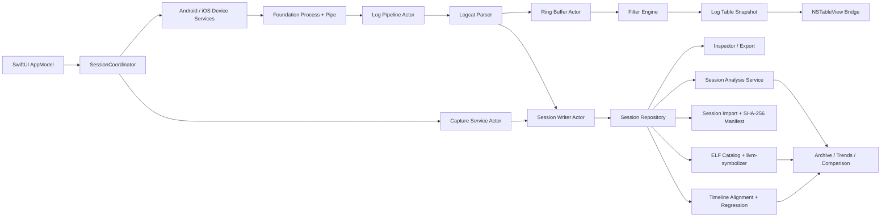

# GameLog 技术架构与 Swift 模块接口清单

> 文档版本：1.2.2  
> 日期：2026-08-11
> 目标平台：macOS 26 及以上  
> UI 技术：SwiftUI + 小范围 AppKit 互操作  
> 并发模型：Swift 6 Concurrency

## 1. 技术可行性结论

方案 1 可使用公开系统 API 完成，不需要 Root、私有 API、系统扩展或内核驱动。

推荐技术组合：

- Swift 6。
- SwiftUI App 生命周期。
- 多实例日志 `WindowGroup` + 单实例归档 `Window` + `Settings`。
- `NavigationSplitView` + `.inspector`。
- 系统 Toolbar、Search 和 macOS 26 Liquid Glass。
- `NSTableView` 通过 `NSViewRepresentable` 承担高吞吐日志显示。
- Foundation `Process` + `Pipe` 启动和读取 ADB 与 iOS 设备工具。
- CoreMediaIO + AVFoundation 从已信任的 iPhone 屏幕采集源读取用户触发的单帧截图。
- `@MainActor` 隔离应用状态，`actor` 隔离会话写入，Sendable Service 隔离 ADB 与媒体任务。
- AVKit 播放录屏，ImageIO/NSImage 处理截图和缩略图。

## 2. 架构原则

1. **业务状态只有一个来源**：SwiftUI/AppModel 持有选择和界面状态，AppKit 不复制业务模型。
2. **UI 与设备工具解耦**：界面依赖协议，不直接创建 `Process`。
3. **数据流持续、UI 批量**：后台逐块读取，解析后批量推送 UI。
4. **日志内存有界、会话文件可持续写入**：环形缓存限制 UI 内存，导出数据不依赖内存是否仍保留。
5. **媒体按需加载**：列表只保存证据元数据，缩略图和视频由 Inspector 加载。
6. **命令参数化**：所有 ADB/iOS 工具调用使用可执行 URL 与参数数组，不通过 Shell。
7. **可测试替换**：设备、日志流、截图和录屏均可使用 Fake 实现。
8. **窗口状态隔离**：每个日志窗口拥有独立 `AppModel`；ADB/会话目录偏好和 `SessionStore` 属于应用共享边界。

## 3. 总体数据流



## 4. 工程组织建议

首版建议使用一个 App Target 加测试 Targets，以目录和协议形成逻辑模块，避免过早拆成多个 Swift Package。稳定后再按边界抽离。

```text
GameLog/
├── App/
│   ├── GameLogApp.swift
│   ├── AppModel.swift
│   └── GameLogCommands.swift
├── Domain/
│   ├── DeviceModels.swift
│   ├── LogModels.swift
│   ├── CaptureModels.swift
│   ├── SessionModels.swift
│   └── FilterModels.swift
├── Features/
│   ├── MainWindow/
│   ├── Sidebar/
│   ├── LogViewer/
│   ├── Inspector/
│   ├── Capture/
│   └── Settings/
├── Services/
│   ├── ADB/
│   ├── iOS/
│   ├── LogPipeline/
│   ├── Capture/
│   ├── Sessions/
│   └── Export/
├── AppKitBridge/
│   └── LogTable/
├── Support/
│   ├── FileSystem/
│   ├── Formatting/
│   └── Diagnostics/
├── GameLogTests/
├── GameLogIntegrationTests/
└── GameLogUITests/
```

## 5. 模块清单

| 模块 | 职责 | 不负责 |
| --- | --- | --- |
| AppModel | 主线程 UI 状态与用户意图路由 | ADB 读写和日志解析 |
| SessionCoordinator | 会话生命周期编排 | 具体 Process 实现 |
| ADBExecutableLocator | 定位和校验 adb | 下载 SDK |
| ADBExecutor | 一次性及流式命令执行 | 业务命令拼装 |
| IOSDeviceToolLocator | 定位和校验内置 iOS 工具集 | 下载或静默安装系统组件 |
| IOSDeviceToolExecutor | iOS 工具一次性及流式执行 | UI 状态与日志解析 |
| IOSDeviceService | iPhone 发现、元数据、配对状态、进程和 PID | App 安装或调试器附加 |
| IOSLogStreamingService | 构造并取消目标进程日志流 | Android Logcat 能力检测 |
| IOSLogParser | iOS syslog Data/Line 到 LogEvent | 缓存和筛选 |
| IOSScreenCaptureService | 用户触发的 iPhone 单帧 PNG | iOS 录屏或远程控制 |
| DeviceMonitor | 设备状态变化 | UI 呈现 |
| ProcessQueryService | 包名、PID 和进程状态 | 日志过滤 UI |
| LogStreamService | 构造并启动 Logcat 流 | 解析具体日志行 |
| LogcatParser | Data/Line 到 LogEvent | 缓存和筛选 |
| LogBuffer | 有界事件缓存 | 磁盘会话归档 |
| LogFilterEngine | 生成过滤后快照 | 修改原始事件 |
| CaptureService | 截图、录屏及远端临时文件 | Inspector 播放 |
| SessionWriter | 持续写入日志和证据元数据 | UI 内存快照 |
| SessionRepository | 会话目录与恢复 | 设备操作 |
| ExportService | 原子导出 txt/jsonl/媒体 | 长期云存储 |
| ThumbnailService | 图片/视频缩略图 | 原始媒体持久化 |
| LogTableBridge | NSTableView 显示与选择 | 业务过滤与持久化 |
| SessionRegistry | 注册窗口级 AppModel 并统一收口 | 复制窗口业务状态 |
| ArchiveModel | 归档窗口状态、趋势与对比路由 | 实时 ADB 采集 |
| SessionAnalysisService | 会话快照、趋势、差异和堆栈提示 | 修改原始会话 |
| Wireless ADB | 配对、连接、断开和输入校验 | 保存配对码 |
| ELFMetadataReader | 读取 ELF class/endian、ABI 与 GNU Build ID | 反汇编或修改库文件 |
| SymbolCatalogStore | 按项目索引符号目录、定位 `llvm-symbolizer` | 复制或删除源 `.so` |
| NativeSymbolicationService | 解析 Native 帧并映射函数/源码/内联帧 | 猜测歧义符号文件 |
| SessionRegressionService | 时间轴对齐和本地回归告警 | 代替 CI 测试结论 |
| SessionStore P2 Import | 校验、原子导入和同 UUID 注释合并 | 云上传或覆盖已有日志 |

## 6. 核心领域模型

以下接口用于表达边界，命名可在实现时按工程规范调整。

```swift
import Foundation

struct DeviceSerial: RawRepresentable, Hashable, Codable, Sendable {
    let rawValue: String
}

struct SessionID: RawRepresentable, Hashable, Codable, Sendable {
    let rawValue: UUID
}

struct LogEventID: RawRepresentable, Hashable, Codable, Sendable {
    let rawValue: UInt64
}

enum DeviceConnectionState: String, Codable, Sendable {
    case device
    case unauthorized
    case offline
    case recovery
}

enum DeviceTransport: String, Codable, Sendable {
    case usb
    case wireless
    case emulator
    case unknown
}

struct AndroidDevice: Identifiable, Hashable, Codable, Sendable {
    var id: DeviceSerial { serial }
    let serial: DeviceSerial
    let displayName: String
    let model: String?
    let product: String?
    let androidVersion: String?
    let apiLevel: Int?
    let transport: DeviceTransport
    let state: DeviceConnectionState
}

struct AndroidProcess: Identifiable, Hashable, Codable, Sendable {
    var id: Int32 { pid }
    let pid: Int32
    let packageName: String
    let processName: String
    let userID: Int?
}
```

### 6.1 日志模型

```swift
enum LogLevel: Int, CaseIterable, Codable, Sendable {
    case verbose = 0
    case debug
    case info
    case warning
    case error
    case fatal
}

enum LogBufferName: String, Codable, Sendable {
    case main
    case system
    case crash
    case events
    case radio
    case unknown
}

enum LogEventKind: Codable, Sendable {
    case log
    case screenshot(artifactID: UUID)
    case recordingStarted(artifactID: UUID)
    case recordingFinished(artifactID: UUID)
    case processLifecycle(description: String)
    case connection(description: String)
    case localSystem(description: String)
}

struct LogEvent: Identifiable, Codable, Sendable {
    let id: LogEventID
    let sessionID: SessionID
    let sequence: UInt64
    let timestamp: Date
    let receivedAtHostTime: Date
    let level: LogLevel?
    let pid: Int32?
    let tid: Int32?
    let tag: String?
    let message: String
    let rawText: String
    let buffer: LogBufferName
    let kind: LogEventKind
}
```

`sequence` 是会话内严格递增序号，用于在设备时间相同或发生时钟调整时维持稳定顺序；`receivedAtHostTime` 用于诊断 ADB 传输延迟，不作为设备事件时间的替代。

### 6.2 过滤模型

```swift
struct LogFilter: Hashable, Codable, Sendable {
    var enabledLevels: Set<LogLevel>
    var includedTags: Set<String>
    var excludedTags: Set<String>
    var targetPIDs: Set<Int32>
    var query: String
    var isCaseSensitive: Bool
    var usesRegularExpression: Bool
    var includesEvidenceMarkers: Bool
}

struct LogTableSnapshot: Sendable {
    let revision: UInt64
    let eventIDs: [LogEventID]
    let rows: [LogTableRow]
    let totalBufferedCount: Int
    let matchedCount: Int
    let evictedCount: UInt64
}

struct LogTableRow: Identifiable, Sendable {
    let id: LogEventID
    let timestampText: String
    let level: LogLevel?
    let pidTIDText: String
    let tagText: String
    let messageText: String
    let kind: LogEventKind
}
```

### 6.3 会话和媒体模型

```swift
enum DebugSessionState: Equatable, Sendable {
    case ready
    case starting
    case capturing
    case recovering
    case stopping
    case stopped
    case failed(GameLogError)
}

enum CaptureArtifactKind: String, Codable, Sendable {
    case screenshot
    case recording
}

enum ArtifactAvailability: String, Codable, Sendable {
    case local
    case remoteOnly
    case downloading
    case unavailable
}

struct CaptureArtifact: Identifiable, Codable, Sendable {
    let id: UUID
    let sessionID: SessionID
    let kind: CaptureArtifactKind
    let startedAt: Date
    let endedAt: Date?
    let localRelativePath: String?
    let remotePath: String?
    let pixelWidth: Int?
    let pixelHeight: Int?
    let byteCount: Int64?
    let availability: ArtifactAvailability
}

struct DebugSession: Identifiable, Codable, Sendable {
    var id: SessionID { sessionID }
    let sessionID: SessionID
    let createdAt: Date
    let endedAt: Date?
    let device: AndroidDevice
    let packageName: String
    let initialPIDs: [Int32]
    let adbVersion: String
    let timeZoneIdentifier: String
}
```

### 6.4 问题、诊断、录屏安全与脱敏模型

```swift
struct IncidentRecord: Identifiable, Codable, Sendable {
    let id: UUID
    let createdAt: Date
    let eventID: UUID
    var title: String
    var note: String
    var evidenceIDs: [UUID]
    var recordingID: UUID?
    var recordingOffset: TimeInterval?
    let logWindowBefore: TimeInterval
    let logWindowAfter: TimeInterval
}

struct DiagnosticIssue: Identifiable, Codable, Sendable {
    let id: UUID
    let kind: DiagnosticIssueKind
    let signature: String
    let title: String
    let summary: String
    let occurrenceCount: Int
    let eventIDs: [UUID]
}

struct RecordingSafetyStatus: Equatable, Sendable {
    let macAvailableBytes: Int64?
    let deviceAvailableBytes: Int64?
    let effectiveAvailableBytes: Int64?
    let estimatedRemainingDuration: TimeInterval?
    let level: RecordingSafetyLevel
}

struct RedactionConfiguration: Codable, Sendable {
    var isEnabled: Bool
    var enabledCategories: Set<RedactionCategory>
}
```

`DebugSession` 同时持久化初始 PID 和会话内观察到的 PID 集合。自动诊断用 PID 集合或包名判断归属，不能把 ADB 截图、录屏等辅助进程的异常归入目标 App。

## 7. ADB 层接口

### 7.1 ADB 定位

```swift
struct ADBInstallation: Hashable, Sendable {
    let executableURL: URL
    let versionDescription: String
    let source: ADBInstallationSource
}

protocol ADBExecutableLocating: Sendable {
    func locate(savedPath: String?) async -> ADBInstallation?
}
```

约束：

- Locator 必须校验文件存在、可执行，并成功运行 `adb version`。
- 搜索顺序固定为用户外部覆盖、App 内置 ADB、环境路径、常用安装位置。
- 自动发现结果不写入“外部覆盖”偏好；用户可一键清除覆盖并恢复内置版本。
- 内置 ADB 位于 `Contents/MacOS/adb`，通过 `Bundle.url(forAuxiliaryExecutable:)` 定位，不能依赖工作目录。

### 7.2 命令执行

```swift
struct ADBCommand: Sendable {
    let serial: DeviceSerial?
    let arguments: [String]
    let timeout: Duration?
}

struct ADBCommandResult: Sendable {
    let stdout: Data
    let stderr: Data
    let exitCode: Int32
}

enum ProcessStreamEvent: Sendable {
    case stdout(Data)
    case stderr(Data)
    case exited(code: Int32)
}

protocol ADBExecuting: Sendable {
    func run(_ command: ADBCommand) async throws -> ADBCommandResult

    /// 取消消费该 Stream 必须终止本次 Process，不影响全局 adb server。
    func stream(
        _ command: ADBCommand
    ) -> AsyncThrowingStream<ProcessStreamEvent, Error>
}
```

实现要求：

- 内部每次运行创建新的 `Process`。
- stdout/stderr 使用独立 Pipe 持续排空。
- 参数按数组传递；Serial 统一由执行器插入 `-s`。
- 取消流时先发送 interrupt，再在超时后 terminate。
- 不执行 `/bin/sh -c`，不执行 `adb kill-server`。

### 7.3 设备和进程服务

```swift
protocol DeviceMonitoring: Sendable {
    func devices() async throws -> [AndroidDevice]
    func updates() -> AsyncThrowingStream<[AndroidDevice], Error>
}

protocol AndroidProcessQuerying: Sendable {
    func runningProcesses(on device: DeviceSerial) async throws -> [AndroidProcess]
    func pids(
        forPackage packageName: String,
        on device: DeviceSerial
    ) async throws -> Set<Int32>
}

protocol WirelessADBManaging: Sendable {
    func pair(host: String, port: Int, code: String) async throws -> String
    func connect(host: String, port: Int) async throws -> String
    func disconnect(host: String, port: Int) async throws -> String
}
```

设备更新可优先使用 ADB 跟踪能力；若不同 Platform Tools 版本兼容性不足，回退到低频轮询。

无线入口在 Service 调用前验证主机字符、端口范围和 6 位配对码。配对码仅存在于设置 View 的临时 `@State`，不进入 AppModel 持久化或日志。

### 7.4 iOS 真机工具接口

```swift
enum IOSDeviceTool: String, CaseIterable, Sendable {
    case deviceID = "idevice_id"
    case deviceInfo = "ideviceinfo"
    case devicePair = "idevicepair"
    case deviceSyslog = "idevicesyslog"
}

protocol IOSDeviceExecuting: Sendable {
    func run(
        _ tool: IOSDeviceTool,
        arguments: [String],
        timeout: Duration
    ) async throws -> ADBCommandResult

    func stream(
        _ tool: IOSDeviceTool,
        arguments: [String]
    ) -> AsyncThrowingStream<ProcessStreamEvent, Error>
}
```

实现约束：

- App 包内四个工具必须成套存在并通过 `idevice_id --version` 校验；任一缺失时 iOS 能力整体标记为不可用，但不得阻塞 Android。
- UDID、进程名等参数只通过数组传递；进程目标必须经过长度和危险字符校验。
- 当前设备信息来自 `ideviceinfo --xml`，日志与进程列表来自 `idevicesyslog`。
- 取消日志流必须只终止当前子进程，不影响其他窗口或 Android ADB Server。
- 当前受管工具为 Apple Silicon `arm64`；Intel 机器不尝试启动不兼容工具。

## 8. Logcat 管线接口

### 8.1 能力检测

```swift
struct LogcatCapabilities: Sendable {
    let supportsPIDFilter: Bool
    let supportsEpochModifier: Bool
    let supportsYearModifier: Bool
    let availableBuffers: Set<LogBufferName>
}

protocol LogcatCapabilityDetecting: Sendable {
    func capabilities(on device: DeviceSerial) async throws -> LogcatCapabilities
}
```

必须通过设备上的 `logcat --help` 探测，不能只根据 Android 版本猜测。

### 8.2 日志流

```swift
struct LogStreamRequest: Sendable {
    let device: DeviceSerial
    let buffers: Set<LogBufferName>
    let targetPIDs: Set<Int32>
    let startTime: Date
}

enum LogStreamChunk: Sendable {
    case bytes(Data)
    case diagnostic(String)
}

protocol LogStreaming: Sendable {
    func stream(
        request: LogStreamRequest
    ) -> AsyncThrowingStream<LogStreamChunk, Error>
}
```

当设备支持 PID Filter 时，将目标 PID 下推给 Logcat；不支持时采集目标缓冲区并在本地过滤。开始时间同理：优先使用设备支持的时间选项，无法可靠下推时由管线忽略会话开始前的历史事件，始终避免使用 `adb logcat -c`。

### 8.3 解析器

```swift
struct ParsedLogRecord: Sendable {
    let timestamp: Date?
    let level: LogLevel?
    let pid: Int32?
    let tid: Int32?
    let tag: String?
    let messageLines: [String]
    let rawLines: [String]
    let buffer: LogBufferName
}

protocol LogcatParsing: Sendable {
    mutating func consume(_ bytes: Data) throws -> [ParsedLogRecord]
    mutating func finish() throws -> [ParsedLogRecord]
}
```

解析器必须处理：

- UTF-8 分块边界。
- 一行跨多个 Data Chunk。
- 一个 Chunk 包含多行。
- 多行堆栈。
- 无法识别的 Raw Line。
- 年份和时区补全。
- 设备日期跨年边界。

## 9. 日志缓存与过滤

```swift
protocol LogBuffering: Sendable {
    func append(_ events: [LogEvent]) async
    func removeAll(reason: String) async
    func event(id: LogEventID) async -> LogEvent?
    func events(ids: [LogEventID]) async -> [LogEvent]
    func stats() async -> LogBufferStats
}

struct LogBufferStats: Sendable {
    let retainedCount: Int
    let evictedCount: UInt64
    let lastEventID: LogEventID?
}

protocol LogFiltering: Sendable {
    func makeSnapshot(
        filter: LogFilter,
        from events: [LogEvent],
        revision: UInt64
    ) async throws -> LogTableSnapshot
}
```

推荐 `LogBuffer` 使用 `actor`。过滤引擎可以使用无状态值类型或独立 Task；正则必须预编译并返回可读错误。

### 9.1 UI 快照策略

- 管线每次可追加任意数量事件。
- Snapshot Scheduler 每 50–100ms 合并脏变更。
- 用户正在浏览历史时只更新数据源，不主动滚动。
- 搜索/过滤变更使用取消前序 Task 的 debounce。
- AppKit Adapter 以 Event ID 为稳定标识更新差异，不依赖数组下标作为身份。

## 10. 截图与录屏接口

```swift
struct ScreenshotRequest: Sendable {
    let device: DeviceSerial
    let sessionID: SessionID
    let requestedAt: Date
}

struct RecordingOptions: Sendable {
    let size: CGSize?
    let bitRate: Int?
    let segmentTimeLimit: Duration
}

enum RecordingState: Equatable, Sendable {
    case idle
    case starting
    case recording(startedAt: Date)
    case stopping
    case downloading(progress: Double?)
    case recoverable(remotePath: String)
    case failed(GameLogError)
}

protocol ScreenshotCapturing: Sendable {
    func capture(_ request: ScreenshotRequest) async throws -> CaptureArtifact
}

protocol ScreenRecording: Sendable {
    func start(
        device: DeviceSerial,
        sessionID: SessionID,
        options: RecordingOptions
    ) async throws -> CaptureArtifact

    func stop() async throws -> CaptureArtifact
    func stateUpdates() -> AsyncStream<RecordingState>
    func recoverRemoteArtifact(_ artifact: CaptureArtifact) async throws -> CaptureArtifact
}
```

实现约束：

- Android 截图使用 `adb exec-out screencap -p` 直接读取 PNG。
- iOS 截图在用户点击后请求视频采集权限，启用公开的 CoreMediaIO iOS 屏幕采集设备，再由 AVFoundation 读取单帧 PNG；必须按 UDID 或精确设备名匹配，不能误采 Continuity Camera。
- Android 录屏使用设备端临时 MP4，再 `pull` 到本地。
- iOS 录屏当前不实现；能力开关必须保持关闭。
- 本地校验成功后才能删除设备端临时文件。
- 用户录屏不设置固定时长；设备原生录屏每 180 秒自动续段，停止后通过 AVFoundation 合并。
- `RecordingSafetyEvaluator` 每 5 秒使用 Mac volume capacity 和 `adb shell df -k /data/local/tmp` 计算两端有效余量；只产生状态和警告，不自动停止任务。
- 录屏接口串行化，同一实例不允许两个活动任务。
- `CGSize` 若造成 Foundation/CoreGraphics 边界耦合，可替换为自定义 Sendable 尺寸值。

## 11. 会话与导出接口

```swift
struct SessionPaths: Sendable {
    let root: URL
    let metadata: URL
    let jsonLinesLog: URL
    let plainTextLog: URL
    let incidents: URL
    let screenshotsDirectory: URL
    let recordingsDirectory: URL
}

protocol SessionRepository: Sendable {
    func create(
        device: AndroidDevice,
        packageName: String,
        pids: Set<Int32>,
        adbVersion: String
    ) async throws -> (DebugSession, SessionPaths)

    func recoverableSessions() async throws -> [DebugSession]
    func artifact(id: UUID, in sessionID: SessionID) async throws -> CaptureArtifact?
    func finalize(sessionID: SessionID, endedAt: Date) async throws
    func discard(sessionID: SessionID) async throws
}

protocol SessionWriting: Sendable {
    func append(events: [LogEvent]) async throws
    func append(artifact: CaptureArtifact) async throws
    func flush() async throws
}

enum ExportScope: Sendable {
    case wholeSession
    case filtered(LogFilter)
    case selected([LogEventID])
}

enum PendingExportKind: Sendable {
    case session(ExportScope)
    case incident(UUID)
}

protocol SessionExporting: Sendable {
    func export(
        sessionID: SessionID,
        scope: ExportScope,
        destination: URL
    ) async throws -> URL

    func exportIncident(
        sessionID: SessionID,
        incidentID: UUID,
        destination: URL,
        redaction: RedactionConfiguration
    ) async throws -> URL
}
```

### 11.1 持久化策略

- `session.json` 保存会话和设备元数据。
- `logs.jsonl` 采集过程中持续追加，作为恢复和结构化导出源。
- `logs.txt` 可在导出时生成，降低持续双写成本。
- `incidents.json` 持久化问题标题、说明、日志窗口与证据关联。
- `analysis.json` 的 P2 格式版本为 2；旧缓存仍可解码，但会自动重算以保留完整 Native 上下文。
- `symbolication.json` 持久化逐帧符号结果，原始日志保持不变。
- 会话根目录的 `.regression-baselines.json` 保存包名到正式基线会话的映射。
- 完整会话导出增加 `diagnostics.json` 和 `redaction.json`；问题包使用相同格式，但只复制时间窗口内日志和关联媒体。
- 会话导出增加 `collaboration-manifest.json`，保存格式版本、应用版本、范围和关键文件 SHA-256。
- 媒体文件使用 UUID 或时间戳命名，元数据保存相对路径。
- 写入发生在 SessionWriter Actor 中，避免多个模块同时操作 FileHandle。
- Flush 应在停止会话、应用进入终止流程和媒体完成时触发。

### 11.2 诊断、脱敏与安全服务

```swift
enum DiagnosticAggregator {
    static func aggregate(
        events: [LogEvent],
        targetPIDs: Set<Int>,
        targetPackage: String?
    ) -> [DiagnosticIssue]
}

enum LogRedactor {
    static func preview(
        events: [LogEvent],
        configuration: RedactionConfiguration,
        deviceSerial: String
    ) -> RedactionPreview
}

enum RecordingSafetyEvaluator {
    static func evaluate(
        macAvailableBytes: Int64?,
        deviceAvailableBytes: Int64?,
        configuredBitRate: Int?
    ) -> RecordingSafetyStatus
}
```

三者均为无状态纯计算服务，允许在 detached utility task 中运行。脱敏扫描和替换只处理本地数据；导出过程仍由 `SessionStore` actor 以临时目录 + 原子移动完成。

### 11.3 P1 归档与分析接口

```swift
extension SessionStore {
    func archiveEntries() throws -> [SessionArchiveEntry]
    func analysis(
        sessionID: UUID,
        forceRefresh: Bool
    ) throws -> SessionAnalysisSnapshot
    func analysisSnapshots(
        forceRefresh: Bool
    ) throws -> [SessionAnalysisSnapshot]
    func updateAnnotation(
        _ annotation: SessionAnnotation,
        sessionID: UUID
    ) throws
}

enum SessionAnalysisService {
    static func snapshot(
        session: DebugSession,
        events: [LogEvent],
        incidentCount: Int,
        logByteCount: Int64
    ) -> SessionAnalysisSnapshot
    static func trends(
        snapshots: [SessionAnalysisSnapshot],
        targetPackage: String?
    ) -> [DiagnosticTrend]
    static func compare(
        baseline: SessionAnalysisSnapshot,
        comparison: SessionAnalysisSnapshot
    ) -> SessionComparison
}
```

`analysis.json` 只缓存已结束会话；追加事件/证据、观察到新 PID 或更新问题记录时立即失效。`annotation.json` 独立于分析缓存，并随完整会话导出。

### 11.4 P2 符号化接口

```swift
struct ELFMetadata: Hashable, Sendable {
    let architecture: NativeABI
    let buildID: String?
}

enum ELFMetadataReader {
    static func read(from url: URL) throws -> ELFMetadata
}

actor SymbolCatalogStore {
    func catalog() throws -> SymbolCatalog
    func index(directory: URL, packagePattern: String) throws -> SymbolCatalogRoot
    func removeRoot(id: UUID) throws
    func resolvedSymbolizerURL() throws -> URL?
}

protocol SymbolizerExecuting: Sendable {
    func symbolize(
        executableURL: URL,
        objectURL: URL,
        address: String
    ) async throws -> String
}

enum NativeSymbolicationService {
    static func parseFrames(issues: [DiagnosticIssue]) -> [NativeStackFrame]
    static func symbolicate(
        sessionID: UUID,
        targetPackage: String,
        issues: [DiagnosticIssue],
        catalog: SymbolCatalog,
        symbolizerURL: URL,
        executor: any SymbolizerExecuting
    ) async throws -> SessionSymbolicationReport
}
```

库匹配顺序为“库名 → GNU Build ID → ABI”。如果候选仍不唯一，返回缺少/歧义状态，不选择“看起来最接近”的文件。`LLVMSymbolizerExecutor` 使用 `Process.executableURL` 与 arguments，支持取消和超时。

### 11.5 P2 导入、对齐与回归接口

```swift
extension SessionStore {
    func previewImport(from selectedDirectory: URL) throws -> SessionImportPreview
    func importSession(from selectedDirectory: URL) throws -> SessionImportResult
    func symbolicationReport(sessionID: UUID) throws -> SessionSymbolicationReport?
    func saveSymbolicationReport(
        _ report: SessionSymbolicationReport,
        sessionID: UUID
    ) throws
    func regressionBaselines() throws -> [RegressionBaseline]
    func setRegressionBaseline(sessionID: UUID) throws -> RegressionBaseline
    func regressionConfigurations() throws -> [RegressionConfiguration]
    func updateRegressionConfiguration(
        _ configuration: RegressionConfiguration
    ) throws -> RegressionConfiguration
}

enum SessionRegressionService {
    static func align(
        baselineSession: DebugSession,
        baselineEvents: [LogEvent],
        baselineSnapshot: SessionAnalysisSnapshot,
        comparisonSession: DebugSession,
        comparisonEvents: [LogEvent],
        comparisonSnapshot: SessionAnalysisSnapshot
    ) -> SessionTimelineAlignment

    static func regression(
        baseline: SessionAnalysisSnapshot,
        comparison: SessionAnalysisSnapshot,
        configuration: RegressionConfiguration?
    ) -> RegressionReport
}
```

导入按“解析到真实会话目录 → 结构与 JSONL 校验 → 可选 SHA-256 校验 → 生成只读预检 → 用户确认 → 重新校验 → 隐藏临时目录复制 → 原子移动”执行。重复 UUID 只在设备、目标包和创建时间等不可变身份一致时进入注释合并；标题取较新值，标签取并集，两个非空且不同的说明均保留。

时间轴锚点顺序为相同诊断签名、唯一规范化日志事件、会话开始时间。回归服务保持纯函数，不持久化或修改会话；基线和 `.regression-configurations.json` 由 `SessionStore` actor 持久化。配置包含归一化阈值和稳定 `metric` 忽略键，服务在生成排序结果后过滤并回报隐藏数量。

## 12. SessionCoordinator

```swift
protocol SessionCoordinating: Sendable {
    func start(
        device: AndroidDevice,
        packageName: String,
        initialFilter: LogFilter
    ) async throws -> DebugSession

    func stop() async throws -> DebugSession
    func takeScreenshot() async throws -> CaptureArtifact
    func markIncident() async throws -> IncidentRecord
    func startRecording(options: RecordingOptions) async throws
    func stopRecording() async throws -> CaptureArtifact
    func stateUpdates() -> AsyncStream<DebugSessionState>
}
```

职责：

1. 校验前置条件。
2. 创建临时会话。
3. 查询 PID 和 Logcat 能力。
4. 启动日志管线、写入器和 PID 监控。
5. 将连接、进程和媒体状态转换为内部 LogEvent。
6. 停止时按“录屏 → 日志流 → 写入 Flush → 会话 Finalize”顺序收尾。

Coordinator 不直接持有 SwiftUI View，也不向 AppKit 发送命令。

## 13. AppModel 与 UI 状态

```swift
import Observation

@MainActor
@Observable
final class AppModel {
    var devices: [AndroidDevice] = []
    var selectedDevice: DeviceSerial?
    var processes: [AndroidProcess] = []
    var selectedPackageName: String?
    var sessionState: DebugSessionState = .ready
    var recordingState: RecordingState = .idle
    var recordingSafetyStatus: RecordingSafetyStatus?
    var incidents: [IncidentRecord] = []
    var diagnosticIssues: [DiagnosticIssue] = []
    var exportPreview: ExportPreviewState?
    var filter: LogFilter
    var tableSnapshot: LogTableSnapshot
    var selectedEventIDs: Set<LogEventID> = []
    var isFollowingLatest = true
    var isInspectorPresented = true
    var presentedError: UserFacingError?
}
```

AppModel 负责：

- 把用户动作转发到 Coordinator/Service。
- 订阅设备、会话、录屏和日志快照。
- 只在 MainActor 更新 View 可见状态。
- 将底层错误转换为用户可执行的提示。

AppModel 不负责：

- 读取 Pipe。
- 解析日志行。
- 打开和写入日志文件。
- 保存长生命周期 `NSTableView` 引用。

### 13.1 多窗口状态与命令路由

```swift
@MainActor
@Observable
final class SessionRegistry {
    func register(_ model: AppModel, id: UUID)
    func closeWindow(id: UUID) async
    func prepareForTermination() async
}

struct SessionSceneView: View {
    @State private var model: AppModel
}
```

- 每个 `SessionSceneView` 创建独立 `AppModel`，但注入同一个 `SessionStore` actor。
- `FocusedValues.gameLogModel` 将菜单动作路由到当前聚焦窗口，不使用全局活动窗口猜测。
- 设置页通过 `SessionRegistry.hasActiveSessions` 锁定共享 ADB/目录和清理操作。
- 关闭窗口调用该模型的标准终止准备；应用退出遍历全部注册模型。

## 14. NSTableView 桥接边界

### 14.1 需要跨越的 SwiftUI 限制

中央日志表需要稳定处理固定行高、高频增量、精确滚动、多选、列宽调整和大量行复用。该能力使用一个窄的 `NSViewRepresentable` 桥接，避免把整个页面改写为 AppKit。

### 14.2 接口草案

```swift
import SwiftUI
import AppKit

struct LogTableView: NSViewRepresentable {
    let snapshot: LogTableSnapshot
    @Binding var selection: Set<LogEventID>
    let followLatestRequest: UInt64
    let onFollowingStateChanged: (Bool) -> Void
    let onColumnConfigurationChanged: (LogColumnConfiguration) -> Void

    func makeCoordinator() -> Coordinator {
        Coordinator(
            selection: $selection,
            onFollowingStateChanged: onFollowingStateChanged,
            onColumnConfigurationChanged: onColumnConfigurationChanged
        )
    }

    func makeNSView(context: Context) -> NSScrollView {
        context.coordinator.makeScrollView()
    }

    func updateNSView(_ scrollView: NSScrollView, context: Context) {
        context.coordinator.apply(
            snapshot: snapshot,
            selection: selection,
            followLatestRequest: followLatestRequest
        )
    }
}
```

### 14.3 Coordinator 职责

- 持有 `NSTableView`、DataSource、Delegate 和 Event ID 到 Row Index 的映射。
- 复用单元格视图并按语义配置文本。
- 把 AppKit 选择变化回写 Binding。
- 监听滚动位置并通知是否仍位于底部。
- 应用列宽和列显隐。

### 14.4 禁止事项

- Coordinator 不持有 LogBuffer 或 SessionRepository。
- Coordinator 不执行搜索和过滤。
- SwiftUI 更新时不无条件 `reloadData()`。
- 不用数组下标作为长期选择身份。
- 不在单元格创建独立 Observable ViewModel。

## 15. 并发与取消模型

### 15.1 Actor 划分

| Actor/隔离域 | 负责 |
| --- | --- |
| MainActor | AppModel 和 View 状态 |
| ADBProcessActor | Process 生命周期和 Pipe |
| LogPipelineActor | 字节解码、解析、事件编号和批处理 |
| LogBufferActor | 环形缓存和事件查询 |
| SessionWriterActor | JSONL 和媒体元数据写入 |
| CaptureActor | 截图、录屏和远端临时文件 |

### 15.2 Task 树

每个 DebugSession 建立一个父 Task，子任务包括：

- Logcat Stream Task。
- PID Monitor Task。
- UI Snapshot Scheduler Task。
- Session Writer Consumer Task。
- Recording Task（按需）。

停止会话时取消父 Task，并显式等待必要的 Flush 和媒体收尾。不得创建脱离会话生命周期的无主 Task。

### 15.3 背压

- Pipe 读取不得等待 UI。
- LogPipeline 将事件批量发送给 Buffer 和 Writer。
- UI Snapshot 可以丢弃中间 Revision，只显示最新 Revision。
- Session Writer 不得丢弃事件；写入队列达到阈值时记录诊断并降低 UI 刷新频率。

## 16. 错误模型

```swift
enum GameLogError: Error, Equatable, Sendable {
    case adbNotFound
    case adbNotExecutable(URL)
    case adbVersionUnsupported(String)
    case deviceUnauthorized(DeviceSerial)
    case deviceOffline(DeviceSerial)
    case packageNotRunning(String)
    case commandFailed(arguments: [String], exitCode: Int32, message: String)
    case logStreamEndedUnexpectedly
    case invalidLogEncoding
    case invalidRegularExpression(String)
    case screenshotFailed(String)
    case recordingAlreadyActive
    case recordingUnavailable(String)
    case recordingInterrupted(remotePath: String?)
    case insufficientDiskSpace(required: Int64, available: Int64)
    case mediaValidationFailed(URL)
    case exportFailed(URL, reason: String)
    case fileSystemFailure(String)
}
```

错误分两层：

- Domain Error：可比较、可测试，不包含 UI 文案。
- UserFacingError：在 MainActor 映射为标题、说明、恢复动作和诊断详情。

原始 stderr 可以进入本地诊断日志，但不得作为唯一用户提示。

## 17. 系统 Framework 映射

| 能力 | Framework/API |
| --- | --- |
| App 生命周期 | SwiftUI `App`, 多实例 `WindowGroup`, 辅助 `Window`, `Settings` |
| 三栏布局 | `NavigationSplitView`, `.inspector` |
| Toolbar/Search | SwiftUI `.toolbar`, `ToolbarSpacer`, `.searchable` |
| Liquid Glass | 系统标准控件；必要时 `glassEffect` |
| 高性能日志表 | AppKit `NSTableView`, `NSScrollView` |
| SwiftUI/AppKit 桥接 | `NSViewRepresentable` |
| ADB 子进程 | Foundation `Process`, `Pipe`, `FileHandle` |
| 图片 | ImageIO, AppKit `NSImage` |
| 视频 | AVFoundation/AVKit |
| 文件选择 | AppKit `NSOpenPanel`, `NSSavePanel` |
| Quick Look | QuickLookUI |
| 日志诊断 | OSLog `Logger` |

## 18. 安全与分发

### 18.1 ADB 安全

- 只运行白名单业务操作所构造的参数。
- 用户输入只作为单个参数或本地过滤表达式，不能成为可执行片段。
- 不读取、复制或导出 ADB 私钥。
- 不自动执行 `adb root`、`remount`、`kill-server` 或设备全局 Logcat 清理。

### 18.2 应用分发

首版推荐：

- Developer ID 签名。
- Hardened Runtime。
- Apple Notarization。
- 应用外直接分发。

本地 Debug 分发脚本是例外：Xcode 26 会把 Debug App 主体放入
`GameLog.debug.dylib`，而 ad-hoc 签名没有 Team ID。若同时启用 Hardened
Runtime，Library Validation 会拒绝加载该 dylib。因此
`build_and_run.sh` 对 Debug 产物使用普通 ad-hoc 签名；Release
`package_release.sh` 继续使用 Developer ID（或临时 ad-hoc）和 Hardened
Runtime。`--verify` 除签名结构校验外，还要求启动进程保持存活，避免只捕获
到 dyld 退出前的短暂进程。

内置 ADB：

- Xcode 的 Copy Files Phase 将 Universal `adb` 放入 `Contents/MacOS`，许可和版本材料放入 `Contents/Resources/ThirdPartyNotices/ADB`。
- 发行脚本按“嵌套 ADB → 外层 App”顺序签名，不使用 `codesign --deep` 代替逐层签名。
- Archive、ZIP、签名、Hardened Runtime、版本、双架构、来源哈希和 NOTICE 均纳入预检。
- 更新 ADB 时必须同步更新二进制、NOTICE、`source.properties`、来源说明和审核哈希。

内置 iOS 设备工具：

- Xcode Copy Files Phase 将 `idevice_id`、`ideviceinfo`、`idevicepair`、`idevicesyslog` 放入 `Contents/MacOS`，运行库放入 `Contents/Frameworks`。
- Mach-O 依赖只能使用 `@executable_path`、`@loader_path` 或 `@rpath`，不得残留 Homebrew 绝对路径。
- 许可、来源、架构和 SHA-256 材料放入 `Contents/Resources/ThirdPartyNotices/iOSDeviceTools`。
- 发行脚本按“iOS 动态库 → iOS 工具 → ADB → 外层 App”逐层签名；预检验证全部嵌套签名、Hardened Runtime、来源哈希、架构和 ZIP 内容。
- 本地 ad-hoc 验证时 iOS 子工具不启用 Hardened Runtime，因为 ad-hoc 签名没有可供动态库校验的共同 Team ID；Developer ID 正式发行仍要求所有层使用同一 Team 并启用 Hardened Runtime。
- 当前发行集为 Apple Silicon `arm64`；不得据此宣称 Intel iOS 支持。

若使用用户提供的外部 ADB：

- 保存 Security-Scoped Bookmark 或可恢复路径信息时，验证重启后访问能力。
- App Sandbox 会让外部子进程和设备访问更复杂；首版不以 Mac App Store 为主要渠道。

### 18.3 会话导入安全边界

- 只接受目录，不执行其中任何文件。
- `session.json` 和每行 `logs.jsonl` 必须可解码；每个 JSON 元数据文件和 JSONL 单行限制 16 MB。
- 媒体与清单路径必须是安全相对路径，拒绝绝对路径和 `..`。
- 拒绝符号链接、非普通媒体文件、会话外引用、摘要不一致及不支持的清单格式。
- 整个导入树共享 100,000 个文件和 50 GB 预算；落盘前使用隐藏临时目录，失败即清理。
- 导入会话中的待恢复录屏被重置，不会对导出方设备执行 ADB 恢复命令。
- P2 没有网络请求、账号令牌或第三方问题单凭据。

## 19. 测试策略

### 19.1 单元测试

- `threadtime` 正常日志。
- 多行 Java/Unity/C++ 堆栈。
- Data Chunk 边界和非法 UTF-8。
- 跨年日期补全。
- Level/Tag/PID/文本/正则过滤。
- Ring Buffer 淘汰顺序。
- Session JSONL 编解码。
- ELF32/ELF64 ABI 与 GNU Build ID 解析。
- 同名符号文件的 Build ID/ABI 唯一匹配与歧义拒绝。
- `llvm-symbolizer` 输出、内联帧和源码位置解析。
- 诊断、唯一日志事件与开始时间三级时间轴对齐。
- 新增 Crash/ANR、错误、Tag 和日志量回归告警。
- Crash/ANR 签名折叠、目标范围与录屏辅助进程排除。
- Token、账号、邮箱、IP、设备序列号和本地路径脱敏。
- Mac/设备空间告警等级与剩余录制时长估算。
- 错误到用户提示映射。

### 19.2 集成测试

- Fake ADBExecutor 模拟 stdout、stderr、退出和超时。
- 设备从 unauthorized → device。
- 设备 device → offline → device。
- 包 PID 重启。
- 截图成功、空 PNG 和命令失败。
- 录屏停止、超时、拉取失败和恢复。
- 导出过程中磁盘写失败。
- 问题记录持久化、关联证据和脱敏问题包原子导出。
- 会话清单导出/导入、摘要篡改、符号链接拒绝和重复注释合并。
- 符号化报告与项目回归基线持久化。

### 19.3 UI 测试

- 首次启动 ADB 缺失恢复路径。
- Sidebar 选择和 Inspector 显隐。
- 搜索焦点和快捷键。
- BrowsingHistory 不被新日志拉回底部。
- 录屏状态与按钮启用规则。
- 深色、浅色、增强对比度和减少透明度。

### 19.4 性能测试

- 2,000 行/秒持续 30 分钟。
- 5,000 行/秒短时突发。
- 50,000/100,000 条缓存切换过滤。
- 频繁选择日志并加载缩略图。
- Inspector 播放视频时保持日志流。
- 重复开始/停止 100 个短会话检查资源泄漏。

## 20. 纵向实现验收

完整 UI 开发以以下纵向场景作为架构验收：

1. 使用真实 `adb` 列出设备。
2. 选择一个包名并解析 PID。
3. 连续读取 `threadtime` Logcat。
4. 通过 Ring Buffer 保存 50,000 条。
5. 使用 `NSTableView` 批量显示并自动跟随。
6. 用户向上滚动后保持位置。
7. 同一会话执行截图，并手动开始、停止一次录屏。
8. 在 Inspector 中显示图片并播放视频。
9. 导出 JSONL、TXT、PNG 和 MP4。
10. 断开并重连 USB 后恢复日志流。
11. 标记问题、自动截图，并从 Inspector 打开脱敏预览。
12. 短录屏手动结束，确认空间护栏状态和非目标崩溃排除。
13. 导出带 SHA-256 清单的会话目录，再导入并验证重复注释合并。
14. 索引项目 `.so` 并执行 Native 符号化，确认歧义库不会被猜测。
15. 将归档会话设为基线，检查时间轴对齐与分级回归告警。

以下场景通过后，方案 1 不存在架构级阻碍。

### 20.1 纵向实现验证结果（2026-07-23）

- macOS 26.5.2、Xcode 26.6、Swift 6.3.3 编译通过。
- 真机 OnePlus 9（LE2110，Android 14）可被 GUI 自动识别，并成功读取 234+ 个应用进程。
- 实时 `adb logcat` 子进程启动成功；日志解析与环形缓冲单元测试通过。
- `screencap` 真机截图成功，并能在 Inspector 中预览。
- 该机厂商 ROM 的 `/system/bin/screenrecord` 会原生崩溃并返回 139。实现已加入兼容策略：原生命令失败后，以约 3 FPS 获取 PNG 帧，并逐帧使用 macOS `AVAssetWriter` 编码 H.264 MP4。最新真机输出验证为 576×1280、10.0667 秒。
- SwiftUI `VideoPlayer` 的动态插入兼容问题已通过小范围 AppKit 桥接解决；当前 Inspector 使用 `AVPlayerView` 内嵌播放，并保留 Quick Look 与系统播放器入口。
- 会话日志持续写入 JSONL，完整会话导出以流式方式生成 TXT，不依赖 50,000 条 UI 缓存，也不会在导出长会话时一次性解码全部 JSONL。
- 设备监测、PID 监测和意外 Logcat 子进程退出分别具备恢复路径；正常退出会停止自有子进程、同步会话并移除 `.inprogress`。
- 兼容录屏逐帧送入 `AVAssetWriter`，持续录制时不在内存中持有完整 PNG 帧数组。
- 自动化测试 73 项通过；360 万条事件加速管线基线为 4.677 秒，100,000 条完整会话导出当前约 4.1 秒。详细证据见《GameLog 实现与验收审计》。
- P2 已覆盖 ELF/Build ID、符号目录隔离、`llvm-symbolizer` 输出解析、会话导入安全、SHA-256 清单、注释合并、时间轴对齐和回归告警。开发机 Android NDK 26 的 `llvm-symbolizer` 可被自动定位并直接执行。
- 2026-07-24 使用 Samsung SM A146U1（Android 15 / API 35）复核问题标记、自动截图、脱敏预览和 22.8 秒手动录屏；录屏状态栏显示 707.42 GB 有效空间及保守剩余时长。
- 真机复核发现 `screencap` 的系统级 fatal signal 曾进入自动诊断，现已通过“观察 PID 或明确包名”范围约束修正，并加入回归测试。

## 21. 开发顺序建议

### Milestone 1：ADB 与日志管线

- ADB Locator/Executor。
- Device Monitor。
- Process Query。
- Logcat Parser。
- Ring Buffer 和压力测试。

### Milestone 2：日志工作区

- SwiftUI 主窗口。
- Sidebar/Toolbar/Inspector。
- NSTableView Bridge。
- 搜索、过滤、自动跟随。

### Milestone 3：证据采集

- 截图。
- 录屏和恢复。
- 证据标记。
- Inspector 媒体展示。

### Milestone 4：会话与交付

- 持续写入。
- 导出和临时恢复。
- Settings。
- 签名、公证和发布验证。

### Milestone 5：本地高级分析与离线协作

- Native 符号目录与地址符号化。
- 会话完整性清单、导入和注释合并。
- 多会话时间轴对齐。
- 项目回归基线和启发式告警。

## 22. 参考资料

- [Apple NavigationSplitView](https://developer.apple.com/documentation/swiftui/navigationsplitview)
- [Apple Applying Liquid Glass to custom views](https://developer.apple.com/documentation/SwiftUI/Applying-Liquid-Glass-to-custom-views)
- [Apple Foundation Process](https://developer.apple.com/documentation/foundation/process)
- [Apple Foundation Pipe](https://developer.apple.com/documentation/foundation/pipe)
- [Android Logcat command-line tool](https://developer.android.com/tools/logcat)
- [Android Debug Bridge：screencap 与 screenrecord](https://developer.android.com/tools/adb#screencap)
